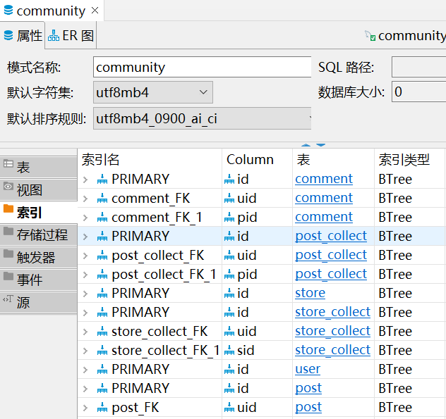

# 城市计算

***1953246 方若愚*** 

---

[toc]

---

## 选题

选题：智慧社交

产品名称：社区一体化平台

## 背景 
城市计算是计算机科学中以城市为背景， 与城市规划、 交通、 能源、 环境、 社会学和经济等学科融合的新兴领域。 城市计算通过不断获取、 整合和分析城市中多种异构大数据来解决城市所面临的挑战。

城市计算在社交领域能有广泛的应用，通过大量数据，平台能够对用户进行推荐，根据用户标签推荐具有相似标签的用户和商铺。

## 需求分析

### 项目背景

对于一个社区而言，为了提高社区居民的黏合度，提高居民归属感，应该为居民提供社区交友，社区讨论，社区推荐等功能。网络平台逐渐普及，因此为了提高居民居住体验，需要设计一个包含：交友，打分，推荐，问答等模块的论坛。

### 产品功能

产品功能如下


#### 用户系统
用户系统即交友系统，需要对社区居民进行实名认证，为每一个居民对应一个包含身份信息的账号。账号之间应该能够实现添加好友，删除好友，拉黑，私信等功能。每个用户都有系统后台添加的标签，用户系统能够根据用户标签进行推荐好友。

1. 实名认证
   用户需要在社区注册时，为该用户提供注册账号，即注册权限由社区持有。
2. 登录系统
   每个用户都有自己的密码，用户登录时需要进行密码验证。
   用户分为普通用户、管理员。不同用户的权限是不同的：
   - 普通用户：在论坛中能够管理自己的贴，能够评论他人的贴，能进行收藏操作
   - 管理员：能管理论坛中的所有贴，能对用户和店铺设置封禁，能为具名创建账号，为用户开通商铺
3. 好友系统
   用户可以通过账号、用户昵称、用户姓名检索的方式搜索其他用户账号，进行添加好友操作。当添加好友成功后，可以删除好友。用户之间可以进行拉黑操作
4. 私信系统
   任意用户之间可以进行私信操作，未添加好有前，私信内容和数量有所限制，添加好友后解除限制
5. 收藏系统
   用户能对某个帖子或商铺执行收藏操作
6. 推荐系统
   根据用户的商铺访问记录和帖子浏览记录，会对用户进行标签化，平台首页会根据用户的标签推荐同标签下访问量最高的帖子，评分最高的商铺，以及标签类似的用户。

#### 商铺系统
为社区内的每一个商铺提供一个账号，包含商铺名，商铺信息，商铺分类，经营者账号以及店铺评分等信息。每个用户如果在一家店铺进行消费后可以对商铺提供的服务进行打分测评。该系统也能根据用户对不同类型的店铺的访问情况对用户进行标签化，商铺系统能根据标签行推荐商铺。每个用户也能收藏店铺。

1. 商铺标签
   用商铺持有者对商铺提供分类标签
2. 商铺评分
   每个用户在店铺进行线上结账后，可以对该店铺的服务进行评分，商铺界面会显示平均评分和评分人数

2. 商铺排序
   商铺是根据一个综合商铺平均评分和评分人数的综合得分进行排序的

#### 论坛系统
论坛需要存储所有贴的标题，内容，分类，评论，以及访问量。用户能够创建贴，删除贴，评论贴，收藏贴。该系统能根据访问量进行排序，并根据标签进行分类。

1. 论坛分区
   论坛分为：问答区，交友区，闲聊区，游戏区，影音区，体育区。这也将作为每个贴的标签
2. 发帖
   用户能编辑新贴，删除贴。用户在某个区发帖，则将该贴的类型设置为该区
3. 评论贴
   用户能对每个贴进行评论
4. 贴排序
   贴是根据访问量进行排序的


## 概念设计

数据库 `community` 包含以下

1. 用户
   用户表 `user`：对应一个用户账号（主键），用户昵称，用户姓名，以及一个不可读的用户标签

   | 字段     | 含义                         | 数据类型    |
   | -------- | ---------------------------- | ----------- |
   | ~~id~~   | ~~用户账号，主键~~           | int         |
   | username | 用户昵称，主键               | string(100) |
   | name     | 用户姓名                     | string(50)  |
   | label    | 用户标签（独热码），有空再写 |             |
   | password | 用户密码                     | string(20)  |
   | email    | 邮箱                         | string(100) |
   | level    | 权限                         | int         |
   | pic      | 头像                         | string(200) |
   
   数字越大权限越高，0 是普通用户，1 是分区管理员（处理举报信息），2 是论坛管理员（处理对管理员的举报，权限变更，用户添加和删除）
   
   用户关系表 `followers` ：关系编号（主键），关注者的账号，被关注者的账号以及用户关系
   
   | 字段     | 含义              |
   | -------- | ----------------- |
   | follower | 用户 1 账号，外键 |
   | followed | 用户 2 账号，外键 |
   
   不同的关系有不同的行为：

   1. 无关注关系
   2. 单向关注：获得关注用户的推送
   3. 双向关注：进一步可以私信
   
   自关联的关系：
   
   user-follow-user
   
   * 左表用户关注右表用户
   * 左侧关系属性为：followed，右侧关系属性为：followers
   * 使用 primaryjoin 和 secondaryjoin，和 sql 的 join
   
2. 商铺系统
   商铺表 `store`：商铺编号（主键），商铺名，商铺介绍，商铺标签以及商铺评分，评分人数。

   | 字段        | 含义                 |
   | ----------- | -------------------- |
   | id          | 商铺编号，主键       |
   | name        | 商铺名               |
   | description | 商铺介绍             |
   | label       | 商铺标签（独热码）   |
   | rating      | 评分                 |
   | rating_num  | 评分人数             |
   | uid         | 商铺持有人账号，外键 |

   商铺收藏表 `store_collect`：收藏编号（主键），商铺编号（外键），用户账号（外键）
   | 字段 | 含义           |
   | ---- | -------------- |
   | id   | 收藏编号，主键 |
   | sid  | 商铺编号，外键 |
   | uid  | 用户账号，外键 |

3. 论坛系统
   贴数据表 `Article`：贴编号（主键），标题，内容，时间，标签，发帖账号（外键），访问量

   | 字段     | 含义           | 数据类型                                      |
   | -------- | -------------- | --------------------------------------------- |
   | id       | 贴编号，主键   | int                                           |
   | title    | 贴标题         | string(50)                                    |
   | content  | 贴内容         | string(50) 存富文本路径？                     |
   | time     | 发帖时间       | datetime                                      |
   | label    | 贴标签         |                                               |
   | username | 发帖账号，外键 | string(100)                                   |
   | visits   | 访问量         | int，每次建立时需要手动设置为 0，默认值不管用 |
   | tag      | 分区           | string(50)                                    |
   
   其中，论坛的分区编号如下：
   
   - 分区编号为 1，生活区
   - 分区编号为 2，学习区
     - 2-1 课程
     - 2-2 考试
   - 后续再加

4. 评论数据表 `comment`：评论编号（主键），评论内容，评论账号（外键），评论贴编号，评论时间

   | 字段       | 含义               | 数据类型 |
   | ---------- | ------------------ | -------- |
   | id         | 评论编号，主键     | int      |
   | content    | 评论内容           | text     |
   | time       | 评论时间           | datetime |
   | username   | 评论账号，外键     | int      |
   | article_id | 评论的贴编号，外键 | int      |

5. 贴收藏表 `post_collect`：收藏编号（主键），贴编号（外键），用户账号（外键)

   | 字段       | 含义               | 数据类型 |
   | ---------- | ------------------ | -------- |
   | user_id    | 收藏账号，外键     | int      |
   | article_id | 收藏的贴编号，外键 | int      |

ER 图为：


## 逻辑设计

### 关系模式

具有函数依赖集 $F$ 的关系模式 $R$ 如果是第三范式，则应该满足，对于 $\alpha\rightarrow\beta\in F^+$，则该依赖至少应满足以下的其中一项：

- $\alpha\rightarrow\beta$ 是一个平凡的函数依赖
- $\alpha$ 是 $R$ 的一个超码
- $\beta-\alpha$ 中的每个属性都包含在 $R$ 的一个候选码中

| 表名     | 关系模式 ${\rm r}(R)$                                        | 依赖集 $F$                                            |
| -------- | ------------------------------------------------------------ | ----------------------------------------------------- |
| 用户     | $\rm user(\underline{id},name,account\_name,label,password)$ | ${\rm id}\rightarrow R$                               |
| 用户关系 | $\rm relation(\underline{id},uid1,uid2,status)$              | ${\rm id}\rightarrow R\\{\rm uid1,uid2}\rightarrow R$ |
| 商铺     | $\rm store(\underline{id},name,description,label,rating,rating\_num,uid)$ | ${\rm id}\rightarrow R$                               |
| 商铺收藏 | $\rm store\_collect(\underline{id},sid,uid)$                 | ${\rm id}\rightarrow R\\{\rm sid,uid}\rightarrow R$   |
| 贴       | $\rm post(\underline{id},title,content,time,label,uid,visits)$ | ${\rm id}\rightarrow R$                               |
| 评论     | $\rm comment(\underline{id},content,time,uid,pid)$           | ${\rm id}\rightarrow R$                               |
| 贴收藏   | $\rm post\_collect(\underline{id},pid,uid)$                  | $\rm id\rightarrow R\\\rm sid,uid\rightarrow id$      |

因此从上表可以看出，每个关系的函数依赖都是属于超码，因此数据库 `community` 的各个关系满足 3NF

### 存储过程

1. 用户收藏的所有商铺
   ```sql
   CREATE PROCEDURE community.store_collect_of(uid0 int)
   begin
   	select sid
   	from store_collect
   	where uid=uid0;
   END
   ```

2. 用户收藏的所有贴
   ```sql
   CREATE PROCEDURE community.post_collect_of(uid0 int)
   begin
   	select pid
   	from post_collect
   	where uid=uid0;
   END
   ```

3. 用户的好友列表
   ```sql
   CREATE PROCEDURE community.friend_of(uid0 int)
   begin
   	select uid
   	from relation
   	where uid1=uid0 or uid2=uid0;
   END
   ```

4. 用户的所有商铺
   ```sql
   CREATE PROCEDURE community.store_of(uid0 int)
   begin
   	select sid
   	from store
   	where uid=uid0;
   END
   ```

5. 一个贴的所有评论
   ```sql
   CREATE PROCEDURE community.comment_of_post(pid0 int)
   begin
   	select id
   	from comment
   	where pid=pid0;
   END
   ```

## 物理设计

由于需要支持模糊查询等功能，数据库的索引采用 B+ 树的数据结构能达到更好的综合性能。为各个表的主键，以及 `user.account_name`，`store_name`，`post.title` 创建索引

B+ 树是由多路平衡查找树优化（B 树）而来的。

m 叉 B 树的每个结点中，最多有 m 个子结点，且每个结点最多存储 m-1 个数据，如图


B 树的插入操作是：

- 找到范围对应的结点，如果插入后小于等于 m-1 个结点，则直接插入
- 否则，插入后对结点进行对半分裂，其中第 $\lceil \frac m2\rceil$ 个搜索码值作为父结点，其左侧作为左子结点，右侧作为右子结点
- 若分裂后将父结点插入时，依然超出最大结点数，则继续分裂

而 B 树的缺点是对范围查询的效率不太好，且查找效率不够稳定。

B+树在 B 树的基础上做出了以下修改：

- 除了叶子结点以外的结点，不再存储数据值，只存储用于比较的搜索码值，这样能大大的提高分叉的数量，能降低树的高度，降低磁盘 IO 次数，而且由于所有的数据都在叶子节点中，这样会具有更稳定的查找效率。
- B+ 树的叶子结点之间有指针相连，且叶子结点和其父结点之间存在冗余。因此对数据进行便利时，只需要对叶子结点遍历即可，这样能增加范围查询的效率。

B+ 树结构如下图所示


B+ 树的插入操作是：

- 找到范围对应的结点，如果插入后小于等于 m-1 个结点，则直接插入
- 否则，插入后对结点进行对半分裂，其中第 $\lceil \frac m2\rceil+1$ 个搜索码值作为父结点，其左侧包含该值作为左子结点，右侧作为右子结点
- 若分裂后将父结点插入时，依然超出最大结点数，则继续分裂

创建的索引如下



## 系统实现 todo


