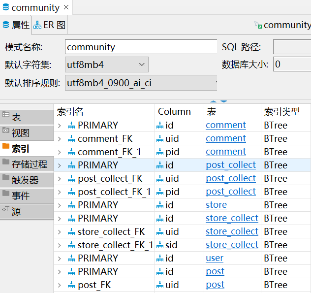

# 城市计算

***1953246 方若愚*** 

---

[toc]

---

## 选题

选题：智慧社交

产品名称：社区一体化平台

## 背景 
城市计算是计算机科学中以城市为背景， 与城市规划、 交通、 能源、 环境、 社会学和经济等学科融合的新兴领域。 城市计算通过不断获取、 整合和分析城市中多种异构大数据来解决城市所面临的挑战。

城市计算在社交领域能有广泛的应用，通过大量数据，平台能够对用户进行推荐，根据用户标签推荐具有相似标签的用户和商铺。

## 需求分析

### 项目背景

对于一个社区而言，为了提高社区居民的黏合度，提高居民归属感，应该为居民提供社区交友，社区讨论，商铺推荐等功能的社区平台。

### 产品功能

社区平台主要包含三个系统：账号系统、商铺系统以及论坛系统。除此以外，该平台也应该做到对社区流量的统计和可视化，建立用户画像和社区热词。

#### 账号系统

账号系统主要包括权限控制和好友管理

1. 该系统需要对不同的账号设置不同的操作权限：
   - 管理员账号：对其他账号的行为和权限进行管控
   - 居民账号：对系统进行基本的操作
   - 商铺账号：由居民账号进行管理

2. 居民账号之间可以进行好友添加，屏蔽等功能

管理员账号为事先设定，居民账号则需要在入住时向管理员进行申请注册。而商铺账号则是由居民账号向管理员账号发出申请进行创建。

所有的居民账号包含一个用户信息和三个列表：好友列表、商铺收藏列表以及话题收藏列表。其中居民用户可以对其他用户发出私信，并进行添加好友，拉黑等操作。

所有的商铺账号应具有一个商铺所有人的居民账号，一个评分信息，商铺分类列表以及一个商铺介绍。

#### 论坛系统

论坛系统主要包括对***话题的分区、话题的管理、话题的搜索以及热度排序***。

其中话题的搜索可以通过建立索引的方式进行查询的优化

论坛需要存储所有贴的标题，内容，分类，评论，以及访问量。用户能够创建贴，删除贴，评论贴，收藏贴。该系统能根据访问量进行排序，并根据标签进行分类。

1. 论坛分区
   论坛分为：生活疑难区，交友区，闲聊区，游戏影音区，运动区。这也将作为每个贴的标签
2. 发帖
   用户能编辑新贴，删除贴。用户在某个区发帖，则将该贴的类型设置为该区
3. 评论贴
   用户能对每个贴进行评论
4. 贴排序
   贴是根据访问量进行排序的

#### 商铺系统

商铺系统主要包括对商铺的***分类、评分以及推荐***。

推荐可以通过推荐算法实现。


产品功能如下


## 概念设计

数据库 `community` 包含以下

1. 用户
   用户表 `user`：对应一个用户账号（主键），用户昵称，用户姓名，以及一个不可读的用户标签

   | 字段         | 含义               |
   | ------------ | ------------------ |
   | id           | 用户账号，主键     |
   | account_name | 用户昵称           |
   | name         | 用户姓名           |
   | label        | 用户标签（独热码） |
   | password     | 用户密码           |

   用户关系表 `relation` ：关系编号（主键），用户 1 的账号，用户 2 的账号以及用户关系

   | 字段   | 含义              |
   | ------ | ----------------- |
   | id     | 关系编号，主键    |
   | uid1   | 用户 1 账号，外键 |
   | uid2   | 用户 2 账号，外键 |
   | status | 用户关系          |

   其中，用户关系有如下几种：

   - relation = 0，好友关系
   - relation = 1，拉黑关系，uid1 拉黑 uid2

   如果 relation 表中没有两个用户的关系，则这两个用户的私信是临时对话

2. 商铺系统
   商铺表 `store`：商铺编号（主键），商铺名，商铺介绍，商铺标签以及商铺评分，评分人数。

   | 字段        | 含义                 |
   | ----------- | -------------------- |
   | id          | 商铺编号，主键       |
   | name        | 商铺名               |
   | description | 商铺介绍             |
   | label       | 商铺标签（独热码）   |
   | rating      | 评分                 |
   | rating_num  | 评分人数             |
   | uid         | 商铺持有人账号，外键 |

   商铺收藏表 `store_collect`：收藏编号（主键），商铺编号（外键），用户账号（外键）
   | 字段 | 含义           |
   | ---- | -------------- |
   | id   | 收藏编号，主键 |
   | sid  | 商铺编号，外键 |
   | uid  | 用户账号，外键 |

3. 论坛系统
   贴数据表 `post`：贴编号（主键），标题，内容，时间，标签，发帖账号（外键），访问量

   | 字段    | 含义           |
   | ------- | -------------- |
   | id      | 贴编号，主键   |
   | title   | 贴标题         |
   | content | 贴内容         |
   | time    | 发帖时间       |
   | label   | 贴标签         |
   | uid     | 发帖账号，外键 |
   | visits  | 访问量         |

   其中，论坛的分区编号如下：

   - 分区编号为 0，问答区
   - 分区编号为 1，交友区
   - 分区编号为 2，闲聊区
   - 分区编号为 3，游戏区
   - 分区编号为 4，影音区
   - 分区编号为 5，体育区

4. 评论数据表 `comment`：评论编号（主键），评论内容，评论账号（外键），评论贴编号，评论时间

   | 字段    | 含义               |
   | ------- | ------------------ |
   | id      | 评论编号，主键     |
   | content | 评论内容           |
   | time    | 评论时间           |
   | uid     | 评论账号，外键     |
   | pid     | 评论的贴编号，外键 |

5. 贴收藏表 `post_collect`：收藏编号（主键），贴编号（外键），用户账号（外键)

   | 字段 | 含义               |
   | ---- | ------------------ |
   | id   | 收藏编号，主键     |
   | pid  | 收藏的贴编号，外键 |
   | uid  | 收藏账号，外键     |

ER 图为：


## 逻辑设计

### 关系模式

具有函数依赖集 $F$ 的关系模式 $R$ 如果是第三范式，则应该满足，对于 $\alpha\rightarrow\beta\in F^+$，则该依赖至少应满足以下的其中一项：

- $\alpha\rightarrow\beta$ 是一个平凡的函数依赖
- $\alpha$ 是 $R$ 的一个超码
- $\beta-\alpha$ 中的每个属性都包含在 $R$ 的一个候选码中

| 表名     | 关系模式 ${\rm r}(R)$                                        | 依赖集 $F$                                            |
| -------- | ------------------------------------------------------------ | ----------------------------------------------------- |
| 用户     | $\rm user(\underline{id},name,account\_name,label,password)$ | ${\rm id}\rightarrow R$                               |
| 用户关系 | $\rm relation(\underline{id},uid1,uid2,status)$              | ${\rm id}\rightarrow R\\{\rm uid1,uid2}\rightarrow R$ |
| 商铺     | $\rm store(\underline{id},name,description,label,rating,rating\_num,uid)$ | ${\rm id}\rightarrow R$                               |
| 商铺收藏 | $\rm store\_collect(\underline{id},sid,uid)$                 | ${\rm id}\rightarrow R\\{\rm sid,uid}\rightarrow R$   |
| 贴       | $\rm post(\underline{id},title,content,time,label,uid,visits)$ | ${\rm id}\rightarrow R$                               |
| 评论     | $\rm comment(\underline{id},content,time,uid,pid)$           | ${\rm id}\rightarrow R$                               |
| 贴收藏   | $\rm post\_collect(\underline{id},pid,uid)$                  | $\rm id\rightarrow R\\\rm sid,uid\rightarrow id$      |

因此从上表可以看出，每个关系的函数依赖都是属于超码，因此数据库 `community` 的各个关系满足 3NF

### 存储过程

1. 用户收藏的所有商铺
   ```sql
   CREATE PROCEDURE community.store_collect_of(uid0 int)
   begin
   	select sid
   	from store_collect
   	where uid=uid0;
   END
   ```

2. 用户收藏的所有贴
   ```sql
   CREATE PROCEDURE community.post_collect_of(uid0 int)
   begin
   	select pid
   	from post_collect
   	where uid=uid0;
   END
   ```

3. 用户的好友列表
   ```sql
   CREATE PROCEDURE community.friend_of(uid0 int)
   begin
   	select uid
   	from relation
   	where uid1=uid0 or uid2=uid0;
   END
   ```

4. 用户的所有商铺
   ```sql
   CREATE PROCEDURE community.store_of(uid0 int)
   begin
   	select sid
   	from store
   	where uid=uid0;
   END
   ```

5. 一个贴的所有评论
   ```sql
   CREATE PROCEDURE community.comment_of_post(pid0 int)
   begin
   	select id
   	from comment
   	where pid=pid0;
   END
   ```

## 物理设计

由于需要支持模糊查询等功能，数据库的索引采用 B+ 树的数据结构能达到更好的综合性能。为各个表的主键，以及 `user.account_name`，`store_name`，`post.title` 创建索引

B+ 树是由多路平衡查找树优化（B 树）而来的。

m 叉 B 树的每个结点中，最多有 m 个子结点，且每个结点最多存储 m-1 个数据，如图


B 树的插入操作是：

- 找到范围对应的结点，如果插入后小于等于 m-1 个结点，则直接插入
- 否则，插入后对结点进行对半分裂，其中第 $\lceil \frac m2\rceil$ 个搜索码值作为父结点，其左侧作为左子结点，右侧作为右子结点
- 若分裂后将父结点插入时，依然超出最大结点数，则继续分裂

而 B 树的缺点是对范围查询的效率不太好，且查找效率不够稳定。

B+树在 B 树的基础上做出了以下修改：

- 除了叶子结点以外的结点，不再存储数据值，只存储用于比较的搜索码值，这样能大大的提高分叉的数量，能降低树的高度，降低磁盘 IO 次数，而且由于所有的数据都在叶子节点中，这样会具有更稳定的查找效率。
- B+ 树的叶子结点之间有指针相连，且叶子结点和其父结点之间存在冗余。因此对数据进行便利时，只需要对叶子结点遍历即可，这样能增加范围查询的效率。

B+ 树结构如下图所示


B+ 树的插入操作是：

- 找到范围对应的结点，如果插入后小于等于 m-1 个结点，则直接插入
- 否则，插入后对结点进行对半分裂，其中第 $\lceil \frac m2\rceil+1$ 个搜索码值作为父结点，其左侧包含该值作为左子结点，右侧作为右子结点
- 若分裂后将父结点插入时，依然超出最大结点数，则继续分裂

创建的索引如下



## 系统实现 todo


